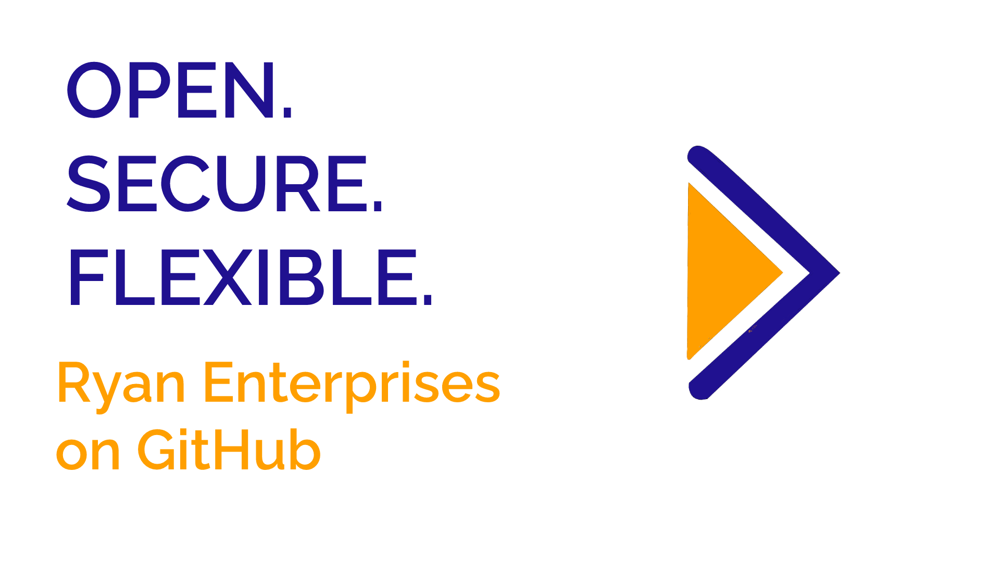

# Welcome to Ryan Enterprises Open Source

## What is Open Source?

Open source is a way to share code and ideas with the world. It is a way to share code that is free to use, and it is a way to share ideas that anyone can repurpose, share, and make their own.

## What We Do Here

Ryan Enterprises uses GitHub to develop and maintain our own projects, or technologies that we use in our projects, that we deem would be beneficial to be open-source.

## What you can do to help

One of the best parts about open source is that the community can contribute to their favorite projects. All of our public repositories are open to contributions, and we encourage you to join the community and contribute to our projects, granted you follow the [Code of Conduct](CODE_OF_CONDUCT.md) and the [Contibution Guidelines](CONTRIBUTING.md).

<!--

**Here are some ideas to get you started:**

🙋‍♀️ A short introduction - what is your organization all about?
🌈 Contribution guidelines - how can the community get involved?
👩‍💻 Useful resources - where can the community find your docs? Is there anything else the community should know?
🍿 Fun facts - what does your team eat for breakfast?
🧙 Remember, you can do mighty things with the power of [Markdown](https://docs.github.com/github/writing-on-github/getting-started-with-writing-and-formatting-on-github/basic-writing-and-formatting-syntax)
-->
